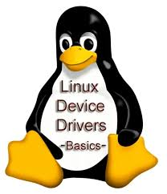

# 李利克斯Drivers
 
我累个豆，李利克斯(linux)写驱动(?  
*我 是 超 级 臃 肿 带 企 鹅* .·´¯(>▂<)¯`·.  
又是一个神奇的课... 
*~~学完这个就是嵌入式带手子~~* 
(不过确实好奇学完这个之后能干什么，嗯造开发板?)
 
 
一个课上讲的查源码的网站: https://elixir.bootlin.com/linux/v3.0.8/source

#### A backup repository of System Programing
Hmm... What an 'open-source' platform, is it?  
But I still have to learn this due to the course requirement :(  
*好一个'开源精神',爆了*
Oct 26th, 2024